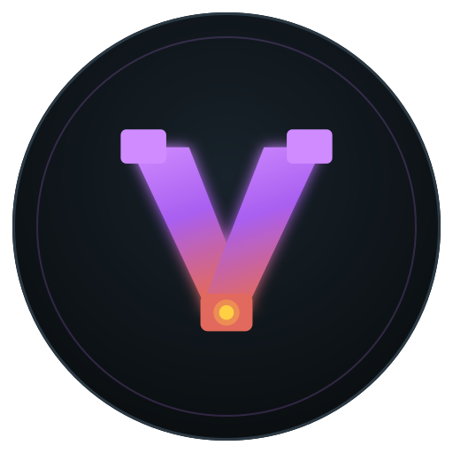
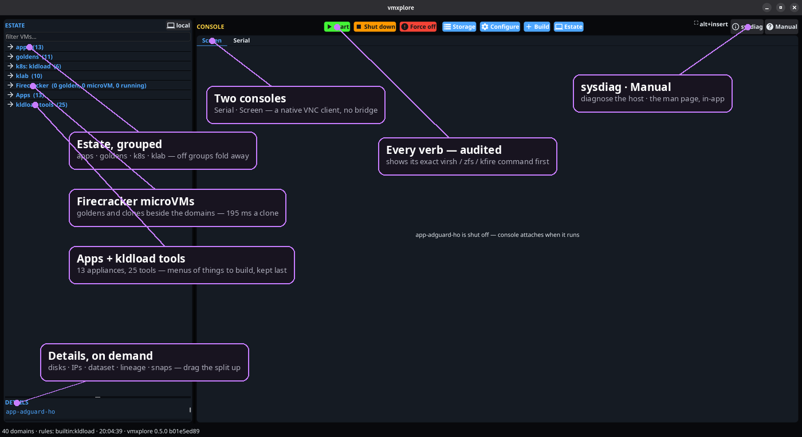
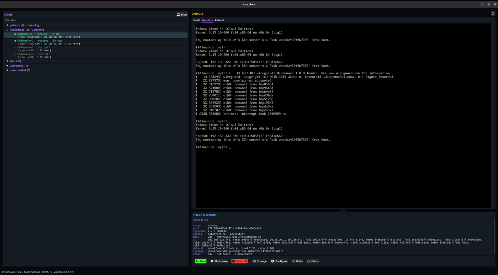
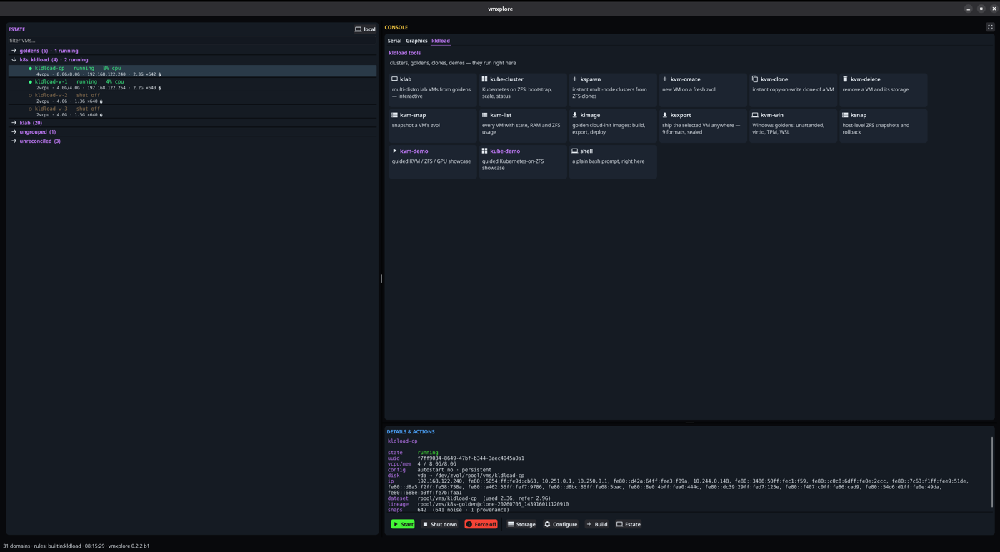
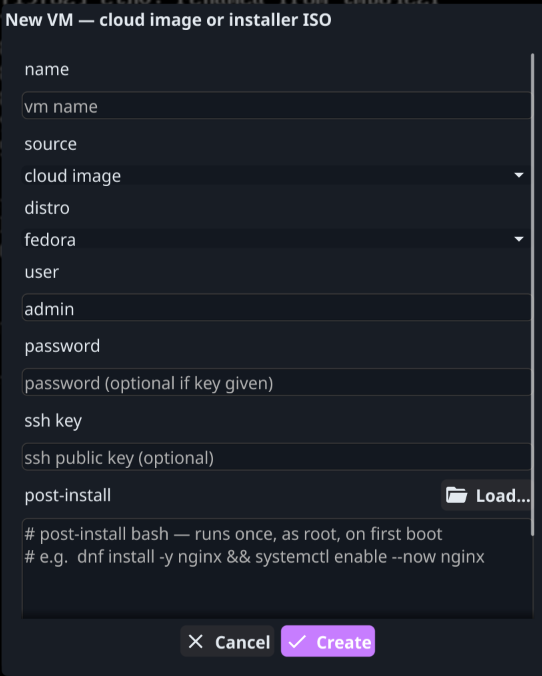
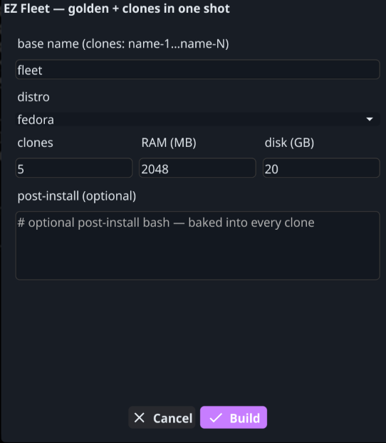
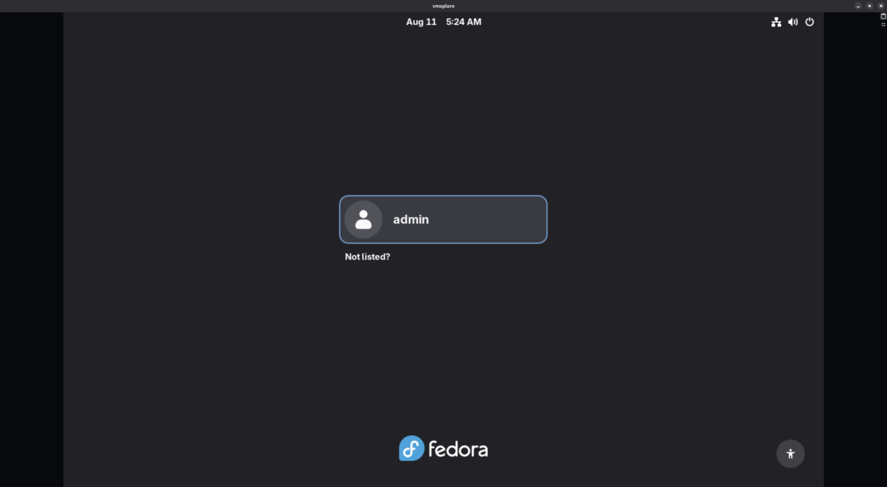
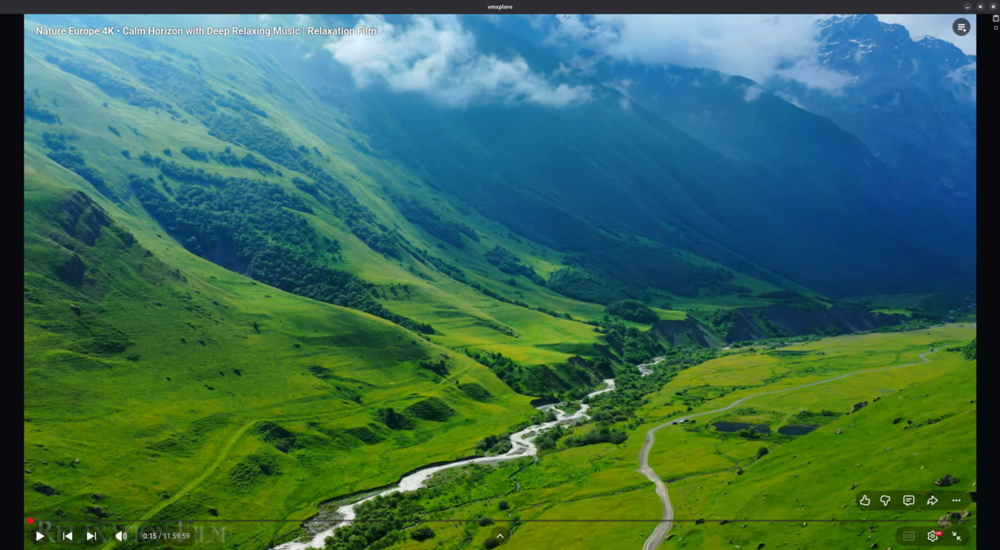
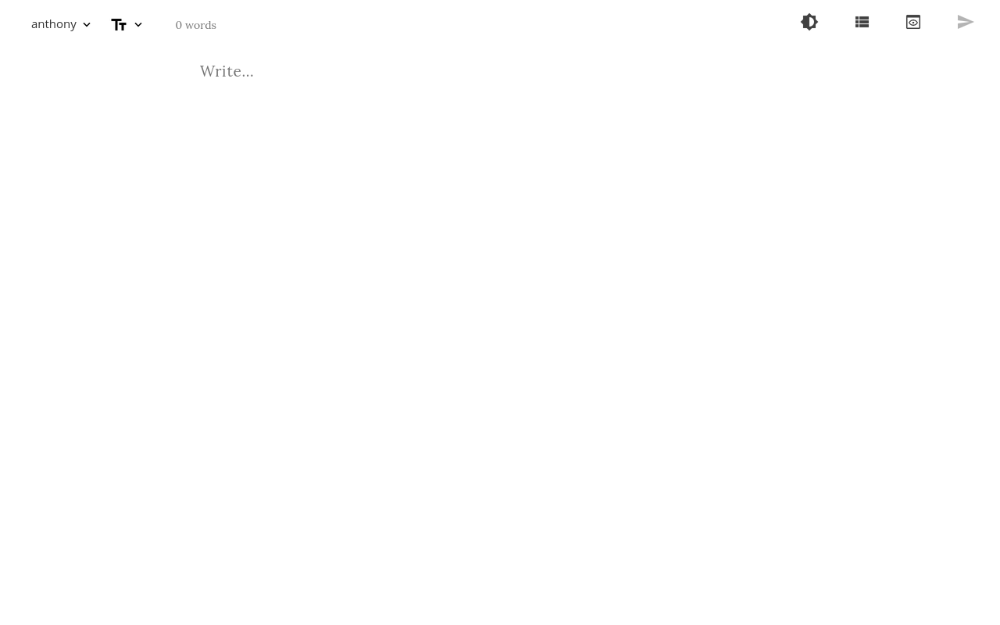

<div align="center">

<h1>
  
  &nbsp;vmxplore
</h1>

**Turn any Linux distro into a powerful hypervisor — GUI *and* TUI, one binary.**

*The KVM console your distro never shipped: the whole estate, one window.*

[](LICENSE)


**The family:** [kldload](https://github.com/kldload/kldload) — the substrate &middot; [zxplore](https://github.com/zxplore/zxplore) — the ZFS console &middot; [wgxplore](https://github.com/wgxplore/wgxplore) — the WireGuard console &middot; **vmxplore** — the VM console



<sub><em>One window: the estate tree, a live console, the full dossier, and every verb — annotated.</em></sub>

</div>

KVM is already in your kernel. libvirt already manages it. What stock Linux
never shipped is the *console* — one window where the estate lives. vmxplore is
that window: a native GUI (and a static TUI for ssh) over the libvirt you
already have. Nothing replaced, no appliance, no agent, no reinstall; `virsh`
is never fought, only shown.

## Three ways to run it

vmxplore is tiered by what the host *can do* — **probed, never licence-checked.**
Start at the first row; each one below adds capability, and the last you don't
build at all. Nothing is held back — the tiers are simply what your machine can
already do.

| You have… | You get… | What it takes |
|---|---|---|
| **stock Linux + KVM** | the full console — estate, serial + VNC consoles, lifecycle verbs, New VM | [a few packages →](#1--stock-linux--kvm) |
| **+ OpenZFS** | the storage join — instant clones, lineage, snapshot classes, golden → fleet | [one repo + a pool →](#2--add-openzfs) |
| **[kldload](https://kldload.com)** | *all of it, pre-wired* — clusters, Windows goldens, air-gap, mesh, eBPF | [nothing — it's already done →](#enhanced-on-kldload) |

The first two are step-by-step guides. The third is a tour of what the
substrate already assembled for you.

## Install

No KVM on the machine yet? That is the normal case, and it is handled:

```bash
curl -fsSLO https://github.com/vmxplore/vmxplore/releases/latest/download/vmx-linux-amd64
sudo install -m0755 vmx-linux-amd64 /usr/local/bin/vmx

vmx --setup      # installs the KVM stack — prints every command BEFORE running any
vmx --tui        # you are in
```

`--setup` reads `/etc/os-release`, picks the package manager for
Debian/Ubuntu, Fedora/RHEL/Rocky, Arch or SUSE, installs the stock KVM stack,
enables `libvirtd`, starts the default network and adds you to the `libvirt`
group. It shows the whole list first, so you can read it, refuse it, or copy
the commands out and run them yourself. Group membership needs a re-login —
it says so rather than leaving you with a permission error.

For the desktop GUI, take `vmxplore-linux-amd64` from the same release and run
`vmxplore`. Both binaries are static; `vmx` has zero runtime dependencies and
there is an `arm64` build. Checksums are in `SHA256SUMS`.

Already have KVM? Skip `--setup` — it will tell you there is nothing to do.
[Building from source, adding OpenZFS, and the kldload substrate](#the-three-ways-in-full)
are further down.

## Push-button machines

Pick a distro. Select your desktop. Done.

| | |
|---|---|
| **Nine cloud images, on tap** | Fedora · Debian · Ubuntu · CentOS Stream · Rocky · AlmaLinux · Amazon Linux · openSUSE Leap · Arch. Each verified against its vendor's own checksum manifest before it touches a disk. Plus RHEL, entitled with your portal login or activation key. |
| **A desktop, if you want one** | GNOME, KDE or XFCE — installed on first boot and rebooted into. Fifteen verified combinations, every package group read off the distribution's own repository rather than guessed. |
| **Applications, configured** | Pick an app, fill in two or three fields, get a VM already running it. The catalogue encodes the four moves every "how to self-host X" post makes — pinned artifact, config, database, unit file — so a weekend becomes a click. |
| **Your own appliances** | Paste a first-boot script and it runs as root. Build the machine you actually want, then seal it into a golden. |
| **Fleets, near-free** | One golden, N zero-copy ZFS clones. Blocks are shared until a clone diverges, so the tenth machine costs almost nothing — and a desktop is installed once on the golden, not once per clone. |
| **27 substrate tools** | On a kldload host the estate grows a tile launcher: cluster builds, golden images, ZFS labs, exports, recovery, demos — grouped in six sections, colour-coded by what they do. |

Every one of those is a template that turns into a running machine in a
gesture. None of them asks you to read a wiki first.

## Highlights

- **A modern VNC client, built from scratch** — the graphics console is a
  hand-rolled RFB (**Remote Frame Buffer**) implementation rendering the guest's
  framebuffer natively into the window, with full mouse, keyboard, and
  two-way clipboard. **No websockify, no noVNC, no virt-viewer — no bridge
  process at all.** It talks straight to qemu's VNC server (over loopback
  locally, over an ssh forward for a remote host), and the GUI runs natively on
  **Wayland** (and X11).

- **An in-app serial console** — a real terminal on `virsh console`, in the
  same window: boot messages, login prompts, headless ttys, copy-paste and all.

- **Remote management over `qemu+ssh`** — `--connect` a headless hypervisor and
  the entire tool follows: estate, verbs, the ZFS join, *and* both consoles, over
  ssh with your own key and `known_hosts` ([the exact trust story](#remote)). No
  agent on the far side.

- **Golden → clone → fleet, on ZFS** — seal a VM into a golden and stamp out N
  zero-copy clones in one gesture; blocks are shared until a clone diverges.

- **Apps — a self-hosted application as one button** — pick an app, fill in its
  two or three fields, and get a configured VM running it. Every "how to
  self-host X" writeup is the same four moves (fetch a pinned artifact, write a
  config, init a database, drop a unit file); the catalog encodes that once per
  app, so a weekend of following a blog post becomes a click.

- **New VM your way** — a cloud image (cloud-init) *or* boot the distro's own
  installer ISO and do it by hand; either way with a custom first-boot script.

- **Knows what the hardware can do** — the host's GPUs are probed from sysfs
  (and over ssh for a remote hypervisor, because the card that matters is the
  one attached to the VMs). Find an NVIDIA card and New VM offers to install
  the drivers in the guest; find none and the option never appears.

- **Sound, plumbed when the machine is built** — every guest gets an emulated
  ich9 card, and a **host audio** checkbox wires it to your PipeWire session:
  the domain gets `<audio type='pipewire'>` and the guest gets an audio stack
  installed on first boot. Both halves or neither — the card alone is a device
  a cloud image has nothing to drive.

  The checkbox is offered only when it can succeed, because qemu treats an
  unreachable audio backend as **fatal**: a domain wired to one that isn't
  there does not start. The probe asks qemu itself, under the same empty
  environment libvirt uses. Remote targets never get it — `virt-install` runs
  on your machine while the guest runs on theirs.

- **It notices when libvirt goes away** — the estate connection redials once on
  a dead socket and retries. Restarting libvirtd used to freeze the tree at its
  last good snapshot while the verbs kept working, so the display could show
  state it could no longer confirm while force-off and delete still landed.

- **Batch operations** — check many VMs and Start / Stop / Reboot / Delete them
  all at once.

- **No confirmation theatre** — clicking delete deletes, and a running VM is
  forced off rather than refused. These are cattle: a VM here is made from a
  golden in seconds. Every command still shows in the status line as it runs
  and lands in an audit log with who ran it and its exit code.

- **One static binary, capability-tiered** — copy `vmx` to any libvirt box; the
  extra powers light up by probe (ZFS, then kldload), never a licence check.

## The Screen tab

The screen pane is the heart of it — pick a running VM and the right tab
attaches automatically, in-window, no external viewer. Five tabs, in the
order of the work: **Serial · Screen · Apps · VM · kldload** — look at the
machine you have, then make one, with the substrate's own toolset last.

There is no button bar. **Alt+Insert** collapses the three-pane layout to the
console alone — estate, details, tabs and border gone — and asks the guest to
change resolution to match, so the picture fills the pane instead of sitting
letterboxed inside it. The same chord comes back out.

Under X11 it fullscreens the window too. Under **Wayland it deliberately does
not**: the protocol never tells a client where its own window is, so the
toolkit picks the primary monitor and a multi-head desktop watches its console
jump to another screen. Use the compositor's own fullscreen key for the frame —
the two compose, and a compositor never picks the wrong head.
`VMX_FULLSCREEN_WINDOW=always|never` overrides either way, and the chord itself
is `VMX_FULLSCREEN_KEY` (Shift-only chords are rejected at startup — the
toolkit never delivers them). **Ctrl+V**
pastes the host clipboard into the guest (as RFB cut text *and* as
keystrokes, so it lands whether or not the guest runs a clipboard agent).
The chord is set with `VMX_FULLSCREEN_KEY` (`alt+delete`, `ctrl+alt+f`,
whatever your guests leave free — Shift-only chords are rejected at startup,
see below) — it is the one key a guest can never
receive, and every candidate collides with something somewhere. Both controls
were icons once; an icon in the corner of a console covers guest pixels for a
whole session to save one keystroke. If your hand is on the mouse, the
top-right corner of a fullscreen console reveals a restore button on hover.

**Ctrl+C, Ctrl+X and Ctrl+A go to the guest**, untouched — so Ctrl+C
interrupts a process in a guest terminal, which is what it is for most of the
time. Copying needs no key here: the guest copies, and its clipboard agent
puts the text on your host clipboard by itself.

### Serial

A real terminal on `virsh console`, right in the pane — boot messages, a login
prompt, a headless server's tty. Copy-paste, resize, the works.

### Screen — a native VNC client, no bridge



<sub><em>The Screen tab: a guest's boot console rendered by a hand-written VNC client — no bridge, no external viewer.</em></sub>

A from-scratch RFB (VNC) client renders the guest's framebuffer directly into
the window, with full mouse, keyboard, and two-way clipboard. It speaks to
qemu's VNC server over loopback — **no websockify, no noVNC, no
virt-viewer.** The picture the web tools bridge to, delivered natively, on
Wayland.

Two deliberate limits, both consequences of the peer always being local qemu:

- **Raw encoding only** (plus the DesktopSize pseudo-encoding, so a guest that
  resizes at boot is followed). Tight and ZRLE exist to buy bandwidth with CPU;
  over loopback or a local ssh forward there is no bandwidth to buy, and every
  codec is decode complexity and attack surface in the client. Pixels go
  uncompressed, on purpose.
- **The guest's clipboard arrives as RFB latin-1**, which is the protocol's
  own limit, so a non-Latin character from an agent-less guest degrades.
  Pasting *into* a guest is done by setting its clipboard and letting the guest
  paste, so full UTF-8 in that direction needs `qemu-vdagent` in the guest —
  which every machine vmxplore builds gets the channel for.

Guests bind their console to `127.0.0.1`, never to every interface, and a
remote hypervisor's console is reached through an `ssh -L` forward over the
same authenticated channel libvirt is already using. No second credential, no
extra open port, and nothing on the wire that a passer-by can type into.

### kldload — the substrate's toolset, one click



<sub><em>The kldload tab on a kernel-loaded substrate: the whole toolset — clusters, goldens, exports, demos — one tile away, running right in the pane.</em></sub>

On a plain libvirt host this tab pitches the OS. On a **kldload** host it
becomes a command center — a tile launcher for the whole kernel-loaded
substrate (see [Enhanced on kldload](#enhanced-on-kldload)). Same one binary —
the abilities light up by capability probe, never a licence check.

## Build a VM the way you want

<table>
<tr>
<td width="50%" valign="top">

<br/><sub><em>New VM — cloud image or installer ISO, with a first-boot script.</em></sub>
</td>
<td width="50%" valign="top">

<br/><sub><em>EZ Fleet — one golden, N zero-copy clones, one click.</em></sub>
</td>
</tr>
<tr>
<td valign="top">

**New VM** — a cloud image (cloud-init configures it, boots ready-to-ssh) *or*
an installer ISO (boot the distro's own installer and run apt/dnf/pacman the
normal way — any ISO, incl. an Arch live ISO or a RHEL DVD). Paste a

**post-install script** and it runs as root on first boot: build your own
appliance, then seal it into a golden.

**Nine cloud images**, each verified against its vendor's own checksum
manifest before it is written to disk — Fedora, Debian, Ubuntu, CentOS
Stream, Rocky, AlmaLinux, Amazon Linux, openSUSE Leap, Arch. RHEL takes a
downloaded image plus your portal login or activation key, and entitles the
guest on first boot.

**And a desktop, if you want one.** Cloud images are headless by design, so
pick GNOME, KDE or XFCE and it installs on first boot and reboots into the
login screen. Five distros × three desktops, every package group read off
the distribution's own repository rather than guessed.



<sub><em>Picked from a dropdown, installed on first boot, rebooted into — Fedora
Workstation's login screen, rendered in the console.</em></sub>



<sub><em>And it is a real desktop: 4K/60 video playing in the guest, through the
hand-rolled RFB client. RFB sends only the rectangles that changed, so a video
in a window costs a fraction of a full redraw.</em></sub>

</td>
<td valign="top">

**EZ Fleet** — pick a distro and a number: it builds one golden, seals it, and
stamps out N zero-copy ZFS clones in a single gesture. "Give me five Fedora
boxes," done. On a ZFS host cloning is instant and near-free — blocks are
shared until a clone diverges.

A desktop costs the same here as one machine: the golden installs it once and
every clone inherits it.

</td>
</tr>
</table>

## GPUs — offered only where they could work

> **For info see:** [NVIDIA on kldload](https://kldload.com/tutorials/nvidia) —
> drivers, CUDA, container sharing and AI inference on the host side.

vmxplore probes the machine that runs the VMs for display controllers, the
driver bound to each, and whether the IOMMU is on. It reads sysfs rather than
shelling out to `lspci`, because sysfs is always there and `lspci` is a
package — and it runs the same probe over ssh for a remote hypervisor, since
the card that matters is the one attached to the VMs, not the one in the
laptop driving them.

Find an NVIDIA card and **New VM** grows an *NVIDIA drivers in the guest*
checkbox, naming the card it found. Find none and the option never appears —
on a machine with no GPU it would be several hundred megabytes of driver, ten
minutes of build, and nothing to drive.

The guest layer composes onto whatever post-install is already there: it
enables `contrib`/`non-free` (a Debian cloud image ships `Components: main`
only, so `nvidia-driver` has no installation candidate at all), installs the
generic kernel with matching headers for DKMS, pins grub to that kernel, and
reboots once.

**What it does not do — and this matters:** installing the driver is the guest
half. *Handing the card to the guest* is host-side `vfio` passthrough, which
this does not touch. Passthrough is exclusive — the host gives the card up
entirely — so on a single-GPU desktop the host's display goes with it. The
checkbox says so, and says when the IOMMU is off, since no card reaches a
guest until it is on.

> A GPU also will not make the console faster. The VNC pane sends *pixels*:
> a 2560x1440 frame is ~14 MB uncompressed. That is a transport question
> (compressed encodings), not a graphics-card question. Drivers in the guest
> are for workloads *inside* it — transcoding, streaming, local AI.

## Apps — an application, running, in one gesture


<sub><em>WriteFreely Desktop: power on, write. No login prompt, no desktop to
navigate — the Screen tab <strong>is</strong> the application. It signs itself
in as the admin you set up, at 2560x1440, and narrates its own first boot on
both consoles while it builds.</em></sub>


Pick an entry, answer its handful of app-specific questions, and the ordinary
New VM pipeline builds it: cloud image, cloud-init, a fixed post-install script,
then a wait until the app actually answers on its port — at which point you are
handed its real URL.

The catalog is **data, not code**. An entry is a struct literal plus a bash
string, so adding an app never touches the pipeline, the GUI or the tests. Two
consequences worth knowing:

- **The generated script is a useful artifact on its own.** `--appliance-script`
  prints it without building anything: ordinary bash with no vmxplore, libvirt
  or ZFS dependency in it, which an upstream project could publish as their own
  "install on a fresh VM" page. It also means you can *read exactly what the
  button is about to run*.
- **Operator input is never interpolated into a script body.** The body is fixed
  bash reading named variables; only shell-quoted assignments are prepended. A
  site name containing a quote, a `$(…)` or a backtick is inert data.

Two entries ship today, both WriteFreely — the same blog, headless or as a
writing machine:

| | |
|---|---|
| **WriteFreely** | 1 vCPU / 1 GB. Minimalist federated blogging behind Caddy with automatic HTTPS. Reach it from your own browser. |
| **WriteFreely Desktop** | 2 vCPU / 3 GB. The same blog *plus a machine to write on*: X, a kiosk window manager and a browser, booting straight into the editor already signed in as the admin you set up. Deliberately not GNOME — measured, `gnome-core` costs 802 additional packages to put one window on screen. |

From the terminal, no GUI needed:

```bash
vmx --appliances                       # the catalog, with each entry's fields
vmx --appliance-script "WriteFreely"   # just print the installer, build nothing

vmx --appliance "WriteFreely" --vm blog \
    WF_SITE_NAME="My Blog" WF_ADMIN_USER=matt
```

It waits for the first boot to finish and prints the appliance's real URL on
stdout. `WF_ADMIN_PASS` is left out above on purpose: password fields left blank
are generated from `crypto/rand` and written to `/root/` inside the guest, so
the happy path needs no typing and no reused password.

## What it refuses to do

A tool that builds machines has to be careful about what it leaves behind.

**Consoles are not open.** Guests bind VNC to loopback. A remote console goes
through an `ssh -L` forward on libvirt's own channel, so there is no
unauthenticated port on the network — RFB has no useful auth of its own, and
an open console is a keyboard on someone else's machine.

**Credentials are not left in cleartext.** The cloud-init seed stays attached
to a guest as a cdrom for its whole life, so the login password goes in as a
crypt SHA-512 hash. The seed is installed `0600`; it carries your ssh key and
your post-install script too.

**Images are verified before they are booted.** Every preset names its
vendor's own checksum manifest — not a digest pinned here, which would be
wrong the day the vendor rebuilds. A mismatch deletes the file, because the
download path is also the cache and one bad transfer would otherwise poison
every later build. Entries whose vendor publishes no manifest are not offered
at all.

**A failed build unwinds itself.** A `sudo` refusal partway through used to
leave an orphan zvol and a seed behind, and the retry then failed on "dataset
already exists" looking like a different bug. Resources are undone
newest-first, and never a disk that existed before the build touched it.

**Desktop recipes are verified, not guessed.** Every package group was read
off the distribution's own repository. Pairs that have not been checked are
not offered — the menu is generated from the same table that installs them,
so it cannot promise something a repo will not satisfy.

## The three ways, in full

The ladder [from the top of this page](#three-ways-to-run-it), each rung with
the actual commands. Hardware is probed the same way software is: [an NVIDIA
card](#gpus--offered-only-where-they-could-work) on the hypervisor adds a driver
option to New VM, and its absence removes it.

**Linux on amd64 or arm64.** The GUI toolkit is cross-platform but the premise
is not: KVM, libvirt and ZFS-on-root are what this drives, so there is no
Windows or macOS build and no plan for one. A remote hypervisor is reached from
a Linux client the same way.

### 1 — stock Linux + KVM

**The short way — download a binary, let it do the rest.** No toolchain, no
build dependencies:

```bash
curl -fsSLO https://github.com/vmxplore/vmxplore/releases/latest/download/vmx-linux-amd64
chmod +x vmx-linux-amd64
sudo install -m0755 vmx-linux-amd64 /usr/local/bin/vmx

vmx --setup      # installs the KVM stack — and prints every command first
vmx --tui        # or add the GUI binary below and run `vmxplore`
```

`vmx` is fully static with zero runtime dependencies, and there is an
`arm64` build too. For the desktop GUI, grab `vmxplore-linux-amd64` from the
same release. Checksums are in `SHA256SUMS`.

> **Going deeper:** [KVM Virtual Machines on ZFS](https://kldload.com/tutorials/kvm)
> is the full treatment — storage layout, golden images, snapshots, replication
> and live migration. This section gets you running; that page is the masterclass.

`--setup` reads `/etc/os-release`, picks the right package manager for
Debian/Ubuntu, Fedora/RHEL/Rocky, Arch or SUSE, installs the KVM stack,
enables `libvirtd`, starts the default network, and adds you to the
`libvirt` group. It shows the whole list before it runs anything, so you can
copy the commands out and run them yourself instead if you prefer.

---

**The long way — build it from source.** Assume a clean, ordinary install
with nothing set up. The KVM stack vmxplore drives, the build toolchain,
then turn it on.

**The KVM stack** (libvirt, `virt-install` for New VM/clone, `qemu-img` +
`xorriso` for the cloud-init seed):

```bash
# Fedora / RHEL / Rocky
sudo dnf install -y qemu-kvm libvirt virt-install libvirt-client qemu-img xorriso

# Debian / Ubuntu
sudo apt install -y qemu-system-x86 libvirt-daemon-system virtinst \
                    libvirt-clients qemu-utils xorriso

# Arch
sudo pacman -S --needed qemu-full libvirt virt-install xorriso
```

Optional: `guestfs-tools` (Fedora/Arch) / `libguestfs-tools` (Debian) adds
`virt-sysprep`, used by **Make Golden** to seal a template generically.

**Go 1.26 or newer** — check before anything else, because this is the one
that bites: several distributions still package an older Go, and the build
stops with `go.mod requires go >= 1.26`. Debian 13 ships 1.24, for example.

```bash
go version                      # need go1.26 or newer
```

If it is older or missing, take the current tarball from
[go.dev/dl](https://go.dev/dl/) — this does not disturb your distro's package:

```bash
curl -fsSLO https://go.dev/dl/go1.26.0.linux-amd64.tar.gz   # use the current filename
sudo rm -rf /usr/local/go && sudo tar -C /usr/local -xzf go1.26.0.linux-amd64.tar.gz
export PATH=/usr/local/go/bin:$PATH                          # add to ~/.profile
```

**The GUI build deps** (cgo + OpenGL; a headless box can skip these and
`make tui` for the static terminal binary only):

```bash
# Fedora / RHEL
sudo dnf install -y git gcc pkgconf-pkg-config mesa-libGL-devel \
     libX11-devel libXcursor-devel libXrandr-devel libXinerama-devel \
     libXi-devel libXxf86vm-devel wayland-devel libxkbcommon-devel fontconfig-devel

# Debian / Ubuntu
sudo apt install -y git gcc pkg-config libgl1-mesa-dev xorg-dev \
     libwayland-dev libxkbcommon-dev libfontconfig1-dev

# Arch
sudo pacman -S --needed git gcc pkgconf libgl libxcursor libxrandr \
     libxinerama libxi wayland libxkbcommon fontconfig
```

**Turn KVM on and join the group** (distro-agnostic):

```bash
sudo systemctl enable --now libvirtd
sudo usermod -aG libvirt "$USER"          # then log out and back in
sudo virsh net-start default              # the NAT network New VM uses
sudo virsh net-autostart default
```

**Build & run:**

```bash
git clone https://github.com/vmxplore/vmxplore && cd vmxplore
make            # vmxplore (GUI+TUI) + vmx (static TUI-only)
sudo make install
```

```bash
vmxplore                 # the GUI
vmx --tui                # the terminal UI (any ssh session)
vmx --once               # print the estate table and exit (scripts)
vmx --connect HOST       # drive a remote hypervisor over qemu+ssh
```

That's it — a stock distro is now a hypervisor with a console. Everything above
is upstream KVM/libvirt; vmxplore only adds the window.

#### Preflight — are you ready?

Confirm each before (or right after) building. vmxplore surfaces these as clear
messages rather than cryptic failures, but checking up front is faster:

- [ ] **CPU virtualization on** (BIOS/UEFI VT-x / AMD-V):
      `grep -Eqc 'vmx|svm' /proc/cpuinfo && echo ok`
- [ ] **KVM device present**: `test -e /dev/kvm && echo ok`
- [ ] **libvirt running**: `systemctl is-active libvirtd`
- [ ] **You're in the `libvirt` group** (log out/in after adding):
      `id -nG | grep -qw libvirt && echo ok`
- [ ] **System libvirt reachable** (this is the estate vmxplore reads):
      `virsh -c qemu:///system list --all`
- [ ] **Default network active** (New VM attaches to it): `virsh net-list --all`
- [ ] **Go new enough** (build only): `go version` — must be **1.26+**; a
      distro-packaged Go is often older, see [above](#1--stock-linux--kvm)
- [ ] **Build tools present** (GUI only): `pkg-config --exists gl && echo ok`
- [ ] **A seed-ISO writer present** (VM / Apps):
      `command -v xorriso genisoimage mkisofs | head -1`

```bash
for c in "grep -Eqc 'vmx|svm' /proc/cpuinfo" "test -e /dev/kvm" \
         "systemctl is-active --quiet libvirtd" "id -nG | grep -qw libvirt"; do
  eval "$c" && echo "ok   : $c" || echo "FIX  : $c"
done
```

### 2 — add OpenZFS

The storage join lights up the moment `zfs` is present and your VMs sit on
zvols. **You don't need ZFS on root** — just a pool with a dataset for VM
volumes. Then clones are instant, lineage shows up, and golden → fleet works.

```bash
# Debian / Ubuntu — in the archive (Debian needs contrib enabled)
sudo apt install -y zfs-dkms zfsutils-linux
```

ZFS is a kernel module, so Fedora, RHEL, Rocky and Arch each need their repo
added first. Rather than restate instructions that go stale, follow the
walkthrough that covers all three package managers end to end:

**[Build ZFS on Root from Scratch →](https://kldload.com/learn/build-zfs-from-scratch)**

You do not need the *on root* part for vmxplore — stop once `zpool status`
works. The page is also the honest version of what kldload automates, if you
ever want to know what the substrate is doing on your behalf.

Make a pool and a home for VM volumes (a spare disk — or a file, just to try it):

```bash
# a whole disk:
sudo zpool create rpool /dev/sdX
# …or kick the tires on a file-backed pool:
truncate -s 40G ~/vmpool.img && sudo zpool create vmpool "$PWD/vmpool.img"

sudo zfs create rpool/vms          # where vmxplore puts VM zvols
```

Now every VM on a zvol shows its used space, snapshot count, and clone lineage
in the tree; **Clone** and **EZ Fleet** become zero-copy `zfs clone` operations
that finish in seconds. Doing this *properly* across a fleet — ZFS on root,
reproducible, air-gapped, snapshot-everything — is exactly what kldload
automates for you (next).

### Enhanced on kldload

[**kldload**](https://kldload.com) is the reproducible, multi-distro substrate:
ZFS on root, an in-kernel WireGuard mesh, eBPF observability, and KVM — assembled
with opinions and wired together, so vmxplore's third tab turns into a command
center where the hard things are already done. Point vmxplore at a kldload box
(or open it right there) and, one tile away:

- **Spin up a cluster from nothing** — `kspawn` conjures a multi-node cluster of
  instant ZFS clones on its own encrypted WireGuard backplane; `kube-cluster`
  brings up Kubernetes-on-ZFS (Cilium eBPF, MetalLB, the ZFS CSI) in one command.

- **Golden images, everywhere** — `kimage` builds a sealed cloud-init golden;
  `kexport` ships any VM to **nine formats** (qcow2, raw, vhd, vmdk, ova, oci,
  lxc, firecracker, all) — feed them to Packer, any cloud, any hypervisor.

- **Windows, unattended** — `kvm-win` builds a Win11/Server golden fully
  hands-off: OVMF Secure Boot, TPM 2.0, virtio, even WSL2 nested — then clones
  it like any other golden.

- **Snapshot everything, undo anything** — every install and change snapshots
  first; roll back the whole transaction, not just a package.

- **Air-gapped and reproducible** — the image *is* the repo; provision a fleet
  from one USB with the network unplugged.

- **The rest of the estate** — a self-forming WireGuard mesh (no DNS, no IPs),
  live eBPF flow maps and tracing, GPU sharing, an on-box model — all on by
  default.

None of that is a vmxplore feature — it's what a **kernel-loaded substrate** can
do, and vmxplore is simply the window that makes it one click. The generic tool
recruits the user; kldload is what the console makes effortless.

## Remote

`--connect <host | user@host | qemu+ssh://host/system>` points the whole tool at
a headless hypervisor over ssh — the estate, the verbs, the ZFS join, the serial
and VNC consoles all follow. (In the GUI, the **Connect** button on the estate
header does the same.)

**The trust anchor**, because a remote hypervisor is a security boundary and
two ssh implementations are involved:

- The estate connection is go-libvirt's pure-Go ssh client. It checks the host
  against your `~/.ssh/known_hosts` and **fails closed** on an unknown or
  changed key. It does *not* read `~/.ssh/config` — so a `Host` alias,
  `IdentityFile`, `User` or `ProxyJump` there is invisible to it; it tries your
  agent, then `~/.ssh/{identity,id_dsa,id_ecdsa,id_ed25519,id_rsa}`. If `ssh
  myhost` only works because of a config stanza, connect with the real
  `user@hostname`.
- Everything that shells out — the ZFS reads and mutations, the console's
  `ssh -L` forward — runs the system `ssh` with the policy set explicitly:
  `BatchMode=yes` (fail instead of hanging on a password prompt no GUI can
  answer), `StrictHostKeyChecking=accept-new` (trust on first use, refuse a
  *changed* key, and ignore an ambient `StrictHostKeyChecking no`) and
  `ConnectTimeout=10`. Every remote command is shell-quoted as a single word,
  so a dataset name can never be re-parsed by the far side's shell.

No second credential and no extra open port either way: the console rides the
same authenticated channel libvirt is already using.

## Grouping rules

Estate grouping and snapshot classification are data, not code: rules files
(embedded generic + kldload profiles, `/etc/vmxplore/rules` or `--rules` to
override). The core contains no site-specific strings.

## License

BSD-3-Clause. Part of the kldload family; built for [vmxplore.dev](https://vmxplore.dev).
